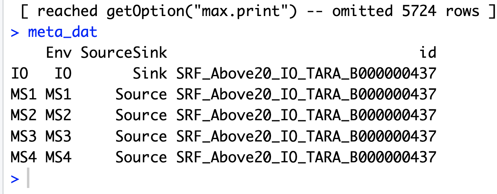

# Signature SNVs for FEAST

## Introduction: 
Elucidating the sources of a microbiome can provide insight into the ecological dynamics responsible for the formation of these communities. “Source tracking” approaches to date leverage species abundance information, however, single nucleotide variants (SNVs) may be more informative because of their high specificity to certain sources. To overcome the computational burden of utilizing all SNVs for a given sample, we introduce a novel method to identify signature SNVs for source tracking. The software provided here in this github generates signature SNVs from SNV tables generated from metagenomic data. In Briscoe et al. 2022 we show that signature SNVs used as input into a previously designed source tracking algorithm, FEAST, can more accurately estimate contributions than species and provide novel insights, demonstrated in three case studies.
 
## What is source tracking?
Source tracking is a broad term for methods that can estimate the percentage of a microbiome of interest that derives from different potential sources. A sample of an infant's gut microbiome may be a sink of interest (Figure 1). 
Two key terms in understanding source tracking and our approach for signature selection are _sink_ and _source_. A _sink_ is a sample that you are interested in investigating the _sources_ of, such as the gut microbiome of an infant. You may be interested in investigating how much the mother, the crib and the dog contribute to this infant's microbiome. You therefore collect samples from all these potential sources. Once you have whole metagenomic shotgun sequencing on these samples, you are ready to begin source tracking analyses. 
 
## What is a signature SNV? 
A signature SNV is a SNV that has a higher probability of coming from one source over other sources or only the sink (Figure 1). Signature-SNVs can be used as input into FEAST for source tracking ([Shenhav et al. 2019](https://github.com/cozygene/FEAST)). Signature SNVs are selected from SNV output produced by running the metagenomic pipeline MIDAS ([Nayfach et al. 2016](https://github.com/snayfach/MIDAS)). Generation of signature-SNVs is described in our paper [Briscoe et al. 2023](https://www.biorxiv.org/content/10.1101/2022.05.28.493810v2). This software generates signature SNVs, which can be used as input into FEAST. 
 
The general workflow is as follows:


[example_1](./example_1) is a toy example of the type of input data you would want to have for Signature-SNVs, while [example_2](./example_2) maybe a more realistic example of the type of input data you may have. 


## Table of Contents

1. [Tutorial](#tutorial)
1. [Quick Start](#quickstart)
1. [Example Input Files](#exampleinput)
1. [Optional Pre-processing of signature SNV files](#preprocessing)
1. [Optional Post-processing of signature SNV files](#postprocessing)
1. [Example run of FEAST](#feast)


## <a name="tutorial"> Tutorial </a>

1. In your documents folder, git clone this repo to get the example directory

    ```
    git clone https://github.com/garudlab/Signature-SNVs.git
    ```
1. [Optional] Go into directory Signature-SNVs and Create a virtual environment
    Note: to avoid any dependency conflicts, we recommend installing this in a virtual environment
    ```
    python3 -m pip install --user virtualenv"
    python3 -m virtualenv signature_snvs_env
    source ./signature_snvs_env/bin/activate
    ```

2. Install Signature-SNVs with pip. (takes about 1 min)
    This also automatically updates any dependencies. 

    ```
    python3 -m pip install Signature-SNVs==0.0.1
    ```

3. Update the paths inside configs/config.yaml to your local paths. See [example config.yaml](#exampleinput).

2. [Option 1] Run code as a module. Start up python in command line interface, then import and run module with example1

    In terminal, open python terminal:
    ```
    python3
    ```

    Once inside python terminal:
    ```
    from signature_snvs import signature_snvs
    signature_snvs.signature_snvs_per_species(species="Bacteroides_uniformis_57318", min_reads=5, start_index=1, end_index=200, config_file_path="configs/config.yaml")
    ```

	[Option 2] Run on command line with example1

    ```
    python <site-packages_directory>/signature_snvs/signature_snvs_cli.py --species Bacteroides_uniformis_57318 --min_reads 5 --start_index 1 --end_index 200 --config_file_path configs/config.yaml
    ```

    For example, my site-packages directory is `./lib/python3.9/site-packages/`


## <a name="quickstart"> Quick Start </a>

1. Install Signature-SNVs with [pip](https://pypi.org/project/Signature-SNVs/0.0.1/) (recommended to install inside a virtual environment). This should take about 1 minute. 
    This also automatically updates any dependencies. 

    ```
    pip install Signature-SNVs==0.0.1
    ```

2. Set up your directories and config.

    **Required input**
    'example_template' shows how the directory and config should be set up

    There can be a single directory containing the following:

    1. **sink_source.csv**  a comma-delimited file with a table consisting of one row per source tracking experiment. The first column of the table should have the accession numbers for each sink of interest, and the following columns should have the accession numbers for the sources for each source tracking experiment. There should be as many rows as source tracking experiments. (example [sink_source.csv](#sinksource))
    2. **midas_output/snps** MIDAS output with a subdirectory called 'snps/', which contains subdirectories for each species. In side each species subsubdirectory are two bzipped files 'snps_depth.txt.bz2' and 'snps_ref_freq.txt.bz2' output from MIDAS snps and MIDAS merge_snps step
    3. **config.yaml** YAML indicating the full path for the input files, the midas_output/snps directory, and the output directory for the signature SNVs (example [config.yaml](#config))

3. Determine input arguments:
    * **species** : the species you want to get signature SNVs for
    * **min_reads** : minimum reads required at a site to determine signature SNVs. Recommend 10 if sufficiently high coverage sample, otherwise 5 reads.
    * **start_index** : is there a specific region you want to check for signature SNVs? This number is the row in the midas output merged snps file for snp_depth and snps_ref_freq. If you want to check the whole file, provide 0.
    * **end_index** :  end index for the region of interest. This number is the row in the midas output merged snps file for snp_depth and snps_ref_freq. If you want to check the whole file, provide the length of the file, or some high number (e.g. 10000000), or determine the length of the file from [here](#preprocessing)
    * **config_file_path** : the path where the config.yaml is located

3. [Option 1] Import and run module

    ```
    from signature_snvs import signature_snvs 
    signature_snvs.signature_snvs_per_species(species="Bacteroides_uniformis_57318", min_reads=5, start_index=1, end_index=200, config_file_path="configs/config.yaml")
    ```

4. [Option 2] Run on command line

    ```
    python <site-packages_directory>/signature_snvs/signature_snvs_cli.py --species Bacteroides_uniformis_57318 --min_reads 5 --start_index 1 --end_index 200 --config_file_path configs/config.yaml
    ```

    For example, my site-packages directory is `./lib/python3.9/site-packages/`


## <a name="exampleinput"> Example Inputs </a>

### <a name="sinksource"> Example sink_source.csv file </a>
This is a comma-delimited file where each row of this table represents a single source tracking experiment. The first cell in each row is the accession number for the sink sample (matching the accession number in the MIDAS output). The second and onward cells in each row should be the accession numbers for the sources for each sink


| family_id	| B	| M	| M1 | M2 | M3|
|-----------|---|---|---|---|---|
|Experiment1	|ERR00001	|ERR00010	|ERR00020	|ERR00030	|ERR00040|
|Experiment2	|ERR00002	|ERR00020	|ERR00030	|ERR00040	|ERR00010|
|Experiment3	|ERR00003	|ERR00030	|ERR00040		|ERR00010	|ERR00020|
|Experiment4	|ERR00004	|ERR00040		|ERR00010	|ERR00020	|ERR00030|

In the toy example_1


| family_id	| B	| M	| M1 | M2 | M3|
|-----------|---|---|---|---|---|
|Test1	|Baby1	|Mother1	|Mother2	|Mother3	|Mother4|
|Test2	|Baby2	|Mother2	|Mother3	|Mother4	|Mother1|
|Test3	|Baby3	|Mother3	|Mother4	|Mother1	|Mother2|
|Test4	|Baby4	|Mother4	|Mother1	|Mother2	|Mother3|


### <a name="config"> Example config.yaml </a>

Example config.yaml:

```
input_dir: '/Users/leahbriscoe/Documents/FEASTX/Signature-SNVs/example_1/'
snp_dir: '/Users/leahbriscoe/Documents/FEASTX/Signature-SNVs/example_1/midas_output/snps/'
output_dir: '/Users/leahbriscoe/Documents/FEASTX/Signature-SNVs/example_1/signature_snvs/'
```
## <a name="preprocessing"> Optional Pre-Processing </a>
Files for pre-processing of the signature SNV output are [here](https://github.com/garudlab/Signature-SNVs/tree/main/preprocessing).
We had determined a window size of 200,000 bp was helpful for analysis. First we determined the length of the species files

To be run inside your data directory (e.g. example_1)
1. Step 1: Get length of all snps_depth file given a list of species in the midas_output/snps directory
2. Step 2: Generate a file with all the lengths of species files


## <a name="postprocessing"> Optional Post-Processing </a>

Files for post-processing of the signature SNV output are [here](https://github.com/garudlab/Signature-SNVs/tree/main/postprocessing).

1. Step 1: Merge signature SNV files across windows per species per source tracking experiment
2. Step 2: Merge signature SNV files across speciess per source tracking experiment


## <a name="downstream"> Optional downstream analysis of Signature-SNVs - specific deails on FEAST </a>

This repository is specifically focused on the extraction of signature SNVs, and the downstream use of these SNVs will depend on the goals of the user. FEAST is one source tracking algorithm that can be applied and there are multiple ways to run FEAST. Please check the documentation of the developers of FEAST to select the best method for you. We have tested FEAST using their [R-package](https://github.com/cozygene/FEAST)

We have an example script for running FEAST

Signature-SNVs/analyses/FEAST_source_tracking_code/SourceTrackingScript.R 

OR

You may write your own script, following these recommended guidelines

1. Generate the merged snvs file consisting of all the signature SNVs across species and across windows (if genomic windows were used) for a given sink-source experiment. e.g. 1 baby, 4 mother samples. e.g. "Transmission_24_9_1" in example 2
2. Place these files in a merged_snvs folder at the same level as sink_source.csv
3. Load the signature SNVs file into a matrix. No modifications are neccessary as you will want the counts data. 

	**snv\_count\_matrix example**. Two signature SNVs with ref and alt counts for each. There are 1 sink and 10 sources in this example 

	

	
	
	
4. Generate a metadata file for feast input ( see metadata example below)

	**metadata example 1**
	
	
	
	**metadata example 2**
	
	
	
5. Run the following FEAST function in R
 
	```
	FEAST(C = snv_count_matrix, metadata =metadata, different_sources_flag = 0, dir_path =input_dir,
	                                   outfile="demo",COVERAGE =coverage_min)
	                                   
	```
6. View the output showing the estimated source tracking proportions. 
	**feast initial output**
	
	

With the script above you can produce a formatted output like below:

**formatted output**


and in csv format

**csv_output**


## <a name="faq"> FAQ </a>


### How do I incorporate multiple species in my analysis?

SignatureSNVs runs on the data from one species at a time, but you can concatenate the results from different species into a single table. This works because SignatureSNVs produces tables with columns that match the order of your sink_source.csv inserts columns for missing species. This columns will contain nan values.

### Will Signature SNVs still work if not every sample is represented in the midas snps output of every species?

Yes. SignatureSNVs final output table will match the sample columns in your sink_source.csv regardless of whether all those samples are represented in the MIDAS output. It will run the analysis on the data present in the MIDAS table, and before finally outputting the table of signature SNVs it will insert columns containing nan values for the missing samples.  

To illustrate, consider 3 samples from the [Tara Oceans dataset](https://ocean-microbiome.embl.de/companion.html): ERR599057, ERR598993, ERR315862 where the first sample is the sink and the latter two are sources. Taking a closer look at the MIDAS snps output for Alpha proteobacterium, we found that only 2 of these samples were represented in snps\_depth.txt and snps\_ref\_freq.txt:

**snps_depth.txt**

||ERR599057|ERR315862|
|--------|---|---|
|CP003801\|1663\|T	| 14	| 71|
|CP003801\|1696\|A	| 19	| 88|
|CP003801\|2233\|T	| 92	| 121|


**snps\_ref\_freq.txt**

|                   | ERR599057           | ERR315862            |
|-------------------|---------------------|----------------------|
| CP003801\|1663\|T | 0.5714285714285714  | 0.0                  |
| CP003801\|1696\|A | 0.42105263157894735 | 0.011363636363636364 |
| CP003801\|2233\|T | 1.0                 | 1.0                  |

SignatureSNVs will account for this, and output the following table: 

**signature\_snvs.csv**

|                   | ERR599057    |  ERR598993     | ERR315862    |
|-------------------|----------------|----------|------------|
|Alt\_Alpha\_proteobacterium\_62227\|CP003801\|1663\|T|3.0|nan|71.0|
|Alt\_Alpha\_proteobacterium\_62227\|CP003801\|1696\|A|1.0|nan|87.0|
|Alt\_Alpha\_proteobacterium\_62227\|CP003801\|2233\|T|1.0|nan|0.0|
|Ref\_Alpha\_proteobacterium\_62227\|CP003801\|1663\|T|17.0|nan|0.0|
|Ref\_Alpha\_proteobacterium\_62227\|CP003801\|1696\|A|27.0|nan|1.0|
|Ref\_Alpha\_proteobacterium\_62227\|CP003801\|2233\|T|11.0|nan|121.0|


This table is the result of running Signature SNVs from example_1 directory:

```
python ../src/signature_snvs/signature_snvs_cli.py --species Bacteroides_uniformis_57318_short --min_reads 5 --start_index 1 --end_index 200 --config_file_path config.yaml

```


## <a name="midas2"> MIDAS 2 Compatibility </a>

MIDAS 2 output is compatible with our software. The output files from the merge step for SNVs in MIDAS2 have the same structure as the original MIDAS software, described in the [MIDAS2 documentation](https://midas2.readthedocs.io/en/latest/snv_module.html#cross-samples-analysis)

| Comparison	| MIDAS | MIDAS2	|
|--------|---|---|
|	merge midas command | merge_midas.py snps | midas2 merge_snps|
| SNPs depth output file |{species}/{species}.snps_depth.txt | {species}/{species}.snps_depth.tsv.lz4 |
| SNPs freq output file |{species}/{species}.snps\_ref\_freq.txt | {species}/{species}.snps_freqs.tsv.lz4 |


